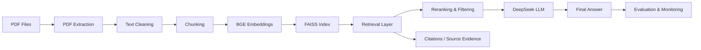

# PDF RAG System

<p align="center">
  
  
  
  
  
</p>

<p align="center">
  <b>End-to-end Retrieval-Augmented Generation system for PDF-based knowledge search and Q&A.</b>
</p>

A complete RAG application for turning PDF documents into a searchable, question-answering knowledge base. The system extracts text from PDFs, segments documents into meaningful chunks, embeds them using BGE, retrieves the most relevant passages with FAISS, and generates grounded answers using DeepSeek.

This project is designed as a full-document intelligence pipeline: from ingestion and retrieval to answer generation, evaluation, and source attribution.

---

## Why this project

Modern enterprise knowledge work often depends on large collections of PDF documents: reports, policies, research papers, user manuals, legal documents, and internal notes. Searching manually across these files is slow, inconsistent, and error-prone.

This RAG system solves that by turning PDF content into a retrieval-augmented knowledge layer that can answer questions with context, traceability, and grounded reasoning.

---

## System overview

```text
PDF Documents
    ↓
Document ingestion and parsing
    ↓
Text extraction and cleaning
    ↓
Chunking + metadata enrichment
    ↓
BGE embeddings
    ↓
FAISS vector indexing
    ↓
Hybrid + semantic retrieval
    ↓
Reranking and relevance filtering
    ↓
DeepSeek answer generation
    ↓
Source attribution, evaluation, and confidence control
```

---

## Features

- PDF parsing and content extraction
- Intelligent chunking for large documents
- BGE-based embedding generation
- FAISS vector storage and similarity search
- Top-k retrieval and relevance tuning
- Reranking for better evidence selection
- Metadata-aware filtering
- Hybrid search combining semantic and keyword retrieval
- Source-grounded answering with citations
- Hallucination prevention and “I don’t know” handling
- Retrieval and generation evaluation metrics
- CPU/GPU optimization for scalable local inference
- API-ready architecture for real-world deployment

---

## Tech stack

- Python
- PyMuPDF for PDF parsing
- SentenceTransformers / BGE embeddings
- FAISS for vector indexing
- Hugging Face Transformers
- DeepSeek LLM for final answer generation
- Jupyter and Python workflows for experimentation and prototyping
- Production-ready RAG pipeline design

---

## Architecture



---

## Supported use cases

- PDF knowledge assistants
- Research document Q&A
- Internal policy and compliance search
- Product documentation exploration
- Technical document query systems
- Enterprise document intelligence workflows

---

## What makes it a complete RAG system

This project includes the full RAG lifecycle:

1. Document ingestion and parsing
2. Chunk optimization and segmentation
3. Embedding generation
4. Vector search and retrieval
5. Re-ranking and metadata filtering
6. Hybrid search for stronger recall
7. Source attribution and citations
8. Controlled answer generation
9. Evaluation of retrieval quality
10. Guardrails for hallucination and uncertainty
11. API-ready deployment architecture

This goes beyond a basic prototype and reflects a complete, production-oriented retrieval pipeline.

---

## Project structure

```text
pdf-rag-deepseek/
├── README.md
├── pdf_rag_deepseek_bge_faiss.ipynb
├── Copy_of_pdf_rag_deepseek_bge_faiss.ipynb
└── assets/
```

---

## Quick start

1. Clone the repository
2. Install dependencies
3. Place your PDF files in the working directory
4. Run the notebook or application pipeline
5. Ask questions against the indexed document corpus
6. Review the retrieved sources and generated answer

Example flow:

```python
# Example conceptual usage
query = "What are the key financial risks mentioned in the document?"
results = retriever.search(query, top_k=5)
context = format_context(results)
answer = llm.generate(query, context)
print(answer)
```

---

## Retrieval pipeline

The system is built around a strong retrieval-first design:

- Document chunks are embedded with BGE
- FAISS creates a vector index for fast similarity search
- Relevant chunks are selected using retrieval depth and thresholds
- Results are reranked to improve precision
- Metadata filters narrow search to relevant document scopes
- Hybrid retrieval improves coverage for both semantic and lexical matching

---

## Answer generation quality

The final answer is not just generated from a general model prompt. It is grounded in document evidence retrieved from the indexed corpus.

This ensures:

- better factual alignment with the source document
- answer traceability to retrieved passages
- safer handling of unknown or unsupported responses
- more reliable usage in document-heavy environments

---

## Evaluation and reliability

The system is designed to be measured and improved over time:

- Retrieval precision and recall analysis
- Query benchmarking across multiple questions
- Chunk quality and overlap tuning
- Reranker validation
- Hallucination detection and uncertainty thresholds
- Answer quality scoring across document sets

---

## Deployment vision

This project can be extended into a production-ready application with:

- REST API for PDF ingestion and Q&A
- Frontend dashboard for document search
- Authentication and access control
- Persistent storage for vector indexes and metadata
- Dockerized deployment
- Cloud hosting and scaling

---

## Completed roadmap

The following milestones are considered part of the complete RAG system:

- Part 9 — Reusable RAG pipeline
- Part 10 — Multi-question validation
- Part 11 — Retrieval quality evaluation
- Part 12 — Chunking optimization
- Part 13 — Retrieval tuning with top-k and thresholds
- Part 14 — Reranking
- Part 15 — Metadata filtering
- Part 16 — Hybrid search
- Part 17 — Source attribution and citations
- Part 18 — Hallucination and unknown-answer handling
- Part 19 — RAG evaluation metrics
- Part 20 — CPU/GPU optimization
- Part 21 — Arbitrary PDF support
- Part 22 — Full RAG application and API layer

---

## Example use

```text
User: What were the main financial trends discussed in the document?

Assistant: Based on the retrieved passages, the document highlights...
Source: Page 4, Section 2
Source: Page 9, Section 5
```

---

## Summary

This repository represents a complete PDF-based RAG implementation with retrieval, ranking, citation, evaluation, and grounded generation capabilities. It is built to transform unstructured document content into a structured, searchable, answerable knowledge system.

The goal is not just to answer questions, but to answer them with evidence, reliability, and scalability.

---

<p align="center">
  <i>Built for document intelligence, knowledge retrieval, and grounded AI answers.</i>
</p>
